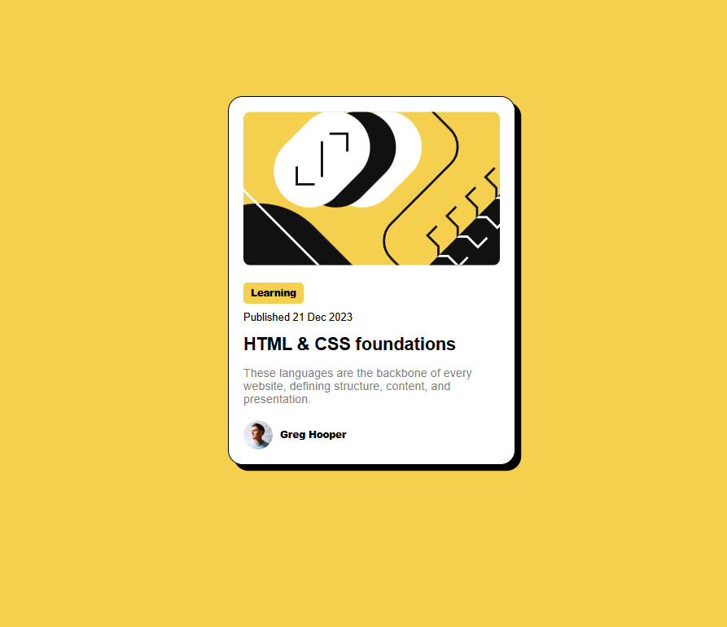

# Frontend Mentor - Blog Preview Card

This is my solution to the [Blog Preview Card challenge](https://www.frontendmentor.io/challenges/blog-preview-card-ckPaj01IcS) on Frontend Mentor. It’s a static, responsive component built with semantic HTML and modern CSS.

---

## Table of Contents

- [Overview](#overview)
  - [Challenge Goals](#challenge-goals)
  - [Screenshot](#screenshot)
  - [Links](#links)
- [My Process](#my-process)
  - [Built With](#built-with)
  - [What I Learned](#what-i-learned)
  - [Next Steps](#next-steps)
- [Author](#author)

---

## Overview

### Challenge Goals

- Replicate the visual design from the provided image
- Build a **responsive blog preview card**
- Add hover states for interactive elements (title)
- Ensure clean layout and semantic HTML

---

### Screenshot



---

### Links

- **Solution**: [GitHub Repo](https://github.com/Vehementum/Challenge1)
- **Live Site**: [Live Demo](https://vehementum.github.io/Challenge1)

---

## My Process

### Built With

- Semantic **HTML5**
- **CSS3** with custom properties
- **Flexbox** for layout
- Mobile-first responsive design
- Git + GitHub for version control

---

### What I Learned

- How to center a component vertically and horizontally using Flexbox
- Responsive design principles using `max-width` + `width: 100%`
- How to apply hover effects cleanly with transitions
- How to structure HTML semantically using `<article>`, `<h2>`, and `<span>` appropriately
- Git basics: staging, committing, pushing, force-pushing to a GitHub repo

```css
.card__title a:hover {
  color: hsl(47, 88%, 63%);
  transition: color 0.2s ease;
}
